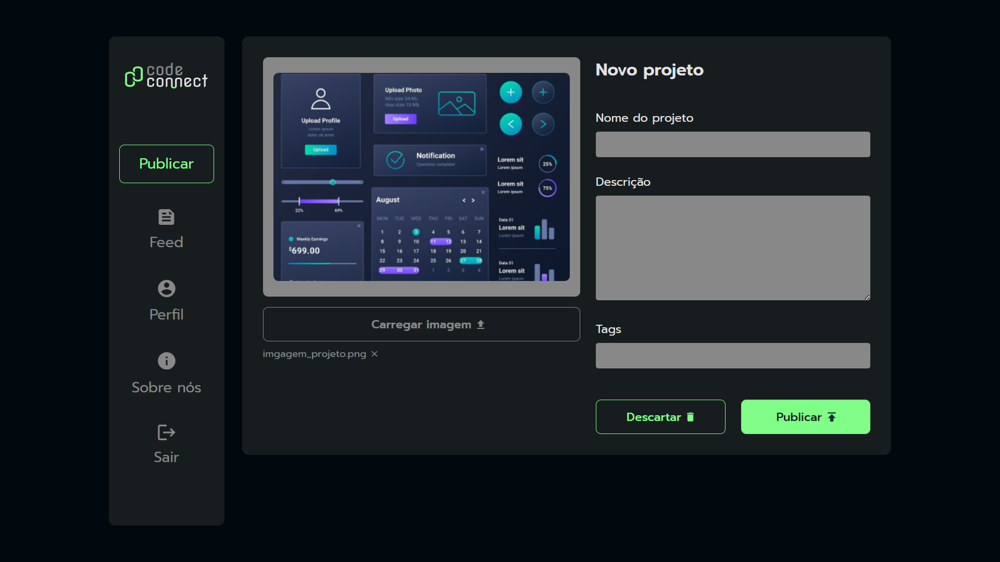
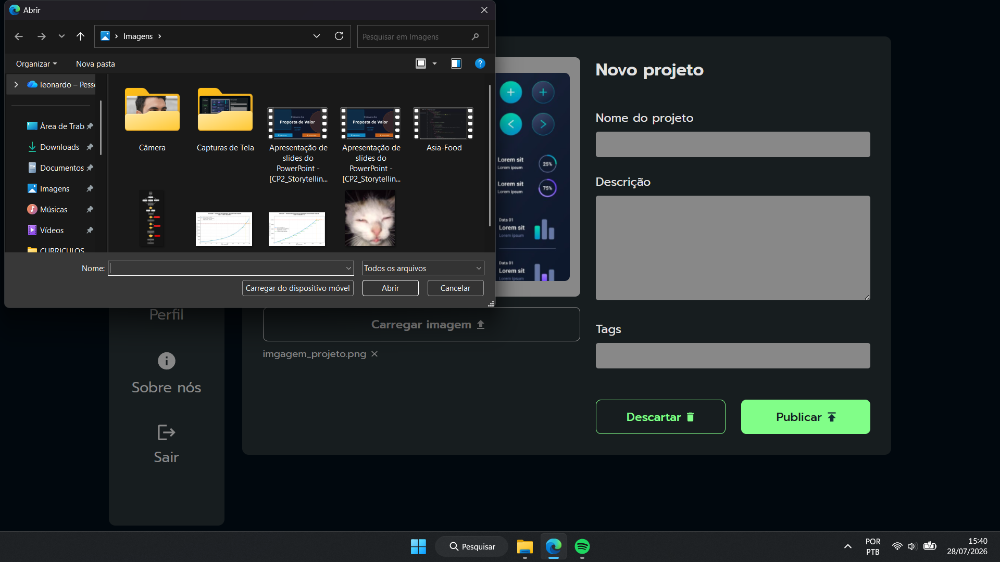
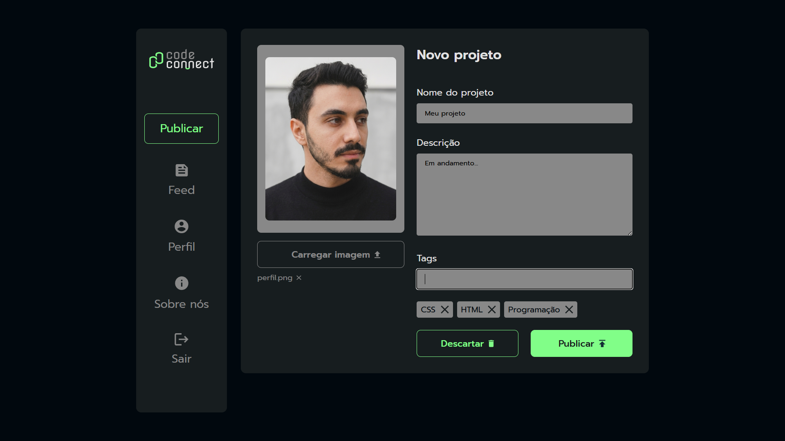

# 🚀 CodeConnect


<p align="center">
  
</p>

<p align="center">
  
  
</p>

---

## 📌 Links

* **Projeto Online:** [Página.CodeConnect.com](https://leonardo-daniel-sc.github.io/pagina-com-javascript-assincrono)
* **Repositório:** https://github.com/Leonardo-Daniel-SC/pagina-com-javascript-assincrono

---

## 📖 Sobre o projeto

O **CodeConnect** é uma interface web inspirada em plataformas de compartilhamento de projetos, onde o usuário pode cadastrar um novo projeto preenchendo seu nome, descrição, imagem de capa e tags.

O projeto foi desenvolvido com foco na prática de manipulação do DOM, eventos, upload de arquivos e criação dinâmica de elementos utilizando JavaScript puro.

---

## ✨ Funcionalidades

* 📷 Upload de imagem para o projeto.
* 👀 Pré-visualização da imagem selecionada.
* 📝 Cadastro do nome do projeto.
* 📄 Adição de descrição personalizada.
* 🏷️ Criação dinâmica de tags.
* ❌ Remoção de tags adicionadas.
* 🚀 Simulação de publicação do projeto.
* 🗑️ Opção para descartar as alterações.
* 📱 Interface moderna e responsiva.

---

## 🛠️ Tecnologias utilizadas

* HTML5
* CSS3
* JavaScript

---

## 📂 Estrutura do projeto

```text
📁 codeconnect
│
├── img/
│   ├── Logo.svg
│   ├── imagem1.png
│   ├── feed.svg
│   ├── account_circle.svg
│   └── ...
│
├── index.html
├── styles.css
├── scripts.js
└── README.md
```

---

## ▶️ Como executar

1. Clone este repositório:

```bash
git clone https://github.com/seu-usuario/nome-do-repositorio.git
```

2. Entre na pasta do projeto:

```bash
cd nome-do-repositorio
```

3. Abra o arquivo **index.html** em seu navegador.

Ou utilize a extensão **Live Server** do Visual Studio Code.

---

## 💡 Como utilizar

1. Clique em **Carregar imagem** e selecione uma imagem para o projeto.
2. Informe o nome do projeto.
3. Escreva uma descrição.
4. Adicione as tags relacionadas ao projeto.
5. Clique em **Publicar** para concluir o cadastro.
6. Caso deseje cancelar, utilize o botão **Descartar**.

---

## 📚 Conceitos praticados

Durante o desenvolvimento deste projeto foram aplicados conceitos como:

* Manipulação do DOM
* Eventos de clique
* Upload de arquivos
* Leitura de arquivos com JavaScript
* Pré-visualização de imagens
* Criação dinâmica de elementos HTML
* Manipulação de listas
* Arrays
* Organização de código
* Validação de formulários
* Boas práticas de desenvolvimento Front-end

---

## 🚀 Melhorias futuras

* 🌙 Tema escuro.
* 🔐 Sistema de login.
* ☁️ Integração com uma API para publicação dos projetos.
* 💾 Armazenamento em banco de dados.
* 🔍 Pesquisa por tags.
* ❤️ Sistema de curtidas.
* 💬 Área de comentários.
* 👤 Perfil de usuário.

---
